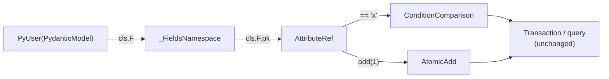

# PR 4: `cls.F` condition / atomic namespace on `PydanticModel`

**Summary**: add `PydanticModel.F` exposing one `AttributeRef` per field for
conditions and atomic operations. Plain `Model` is unchanged — descriptor
style `User.pk == "x"` stays the only path on `Model`.

## Motivation

On `PydanticModel`, class-level `User.pk` is a `FieldInfo`. Operator
overloads on `Attribute` cannot run. `User.F.pk == "x"` and
`User.F.counter.add(1)` delegate to the same `Condition*` and `Atomic*`
classes used today, so transactions, updates, and queries need no changes.

The original plan added `cls.F` to both classes. The revised plan scopes it
to **`PydanticModel` only** to avoid adding API surface plain `Model` users
do not need.

## Scope

In:

- `AttributeRef` in
  [python/pydynox/_internal/_model/_refs.py](../../../python/pydynox/_internal/_model/_refs.py)
  wrapping an `Attribute`:
  - Comparison operators → `ConditionComparison`.
  - `exists()`, `not_exists()`, `begins_with()`, `contains()`, `between()`,
    `is_in()`, nested `__getitem__`.
  - `set()`, `add()`, `remove()`, `append()`, `prepend()`, `if_not_exists()`.
- `_FieldsNamespace` built lazily from `cls._attributes`, exposed as `cls.F`.
- Optional `cls.F["pk"]` string lookup.
- Wired in `_PydanticModelMeta` after schema collection (PR 3).

Out:

- Adding `cls.F` to plain `Model` or deprecating `User.pk == "x"`.
- Changes to transaction/query modules beyond accepting existing condition types.

## Design



## Public API

```python
cond = Order.F.status == "SHIPPED"
tx.update(Order, key={"pk": order.pk}, atomic=[Order.F.total_cents.add(100)])
```

## Back-compat

Plain `Model` unchanged.

## Test plan

- `Order.F.pk == "x"` serializes identically to equivalent `Model` condition
  built via descriptor style (reference fixture).
- Atomic ops in a transaction commit successfully.
- `cls.F["field_name"]` dynamic lookup.

## Size

M. Roughly 150–250 LOC.

## Depends on / unblocks

- Depends on: PR 3.
- Unblocks: PR 6 (parity tests for conditions/atomics on `PydanticModel`).
