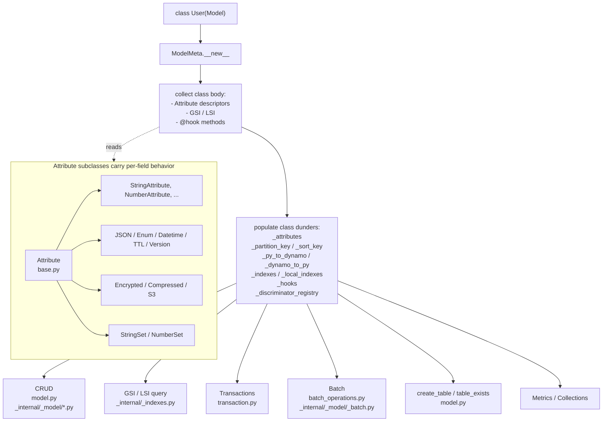
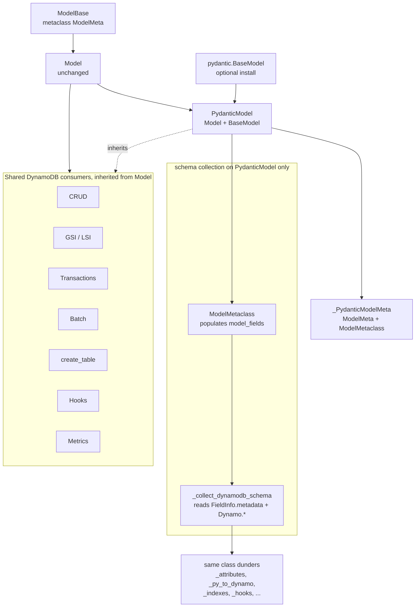

# Overview: Optional Pydantic integration via `PydanticModel`

## Executive summary

pydynox's `Model` today is a hand-rolled schema system built on class-body
`Attribute` descriptors. It gives users a rich DynamoDB-aware API but no
Pydantic ergonomics: you cannot attach `Field(description=...)`, you cannot
add a `@field_validator`, you cannot emit a JSON schema, you cannot nest
ordinary `BaseModel`s.

The **sibling decorator path** (`@dynamodb_model` in
[python/pydynox/integrations/pydantic.py](../../../python/pydynox/integrations/pydantic.py))
gives you a real `BaseModel` but strips almost every DynamoDB feature:
no aliases, no templates, no indexes, no hooks, no encryption, no TTL, no
version, no discriminator, no atomic ops, no conditions, no `ModelConfig`.

This refactor resolves the gap **without forcing Pydantic on users who do
not want it**. `Model` stays exactly as today — no renames, no second field
declaration style, no deprecation warnings. A new opt-in
`PydanticModel(Model, BaseModel)` class gives Pydantic users the full
DynamoDB feature set plus everything Pydantic provides. Pydantic itself
stays behind the `pydynox[pydantic]` extra.

## Motivation

Concrete pain points this refactor addresses, for users who opt into
Pydantic:

1. **Docs and schema**: `Field(description=..., examples=..., json_schema_extra=...)`
   for OpenAPI / MkDocs / admin UIs.
2. **Validation**: `Field(pattern=..., ge=..., max_length=...)` and
   `@field_validator` / `@model_validator` without writing custom Attribute
   subclasses.
3. **Serialization**: `model_dump_json()` / `model_validate_json()` out
   of the box, without the current JSON re-serialization dance.
4. **Nested models**: a Pydantic `BaseModel` can contain another `BaseModel`
   directly; today you need `JSONAttribute[SomeModel]` and extra plumbing.
5. **One canonical way for Pydantic users**: removes the recurring "should
   I subclass `Model` or use `@dynamodb_model`?" question by deprecating
   the decorator in favor of `PydanticModel`.

Users who do not want Pydantic see **no dependency change and no API change**.

## Current architecture



Key properties we want to keep:

- Downstream consumers (CRUD, GSI/LSI, transactions, batch, table ops,
  metrics, hooks) read **only** the class dunders. They never touch the
  descriptor protocol.
- `Attribute.serialize` / `deserialize` is the only per-field customization
  point that matters for DynamoDB wire format.
- Indexes (`GlobalSecondaryIndex` / `LocalSecondaryIndex`) are plain class
  attributes that `__set_name__` / `_bind_to_model` wire up.

## Target architecture



Invariants after the refactor:

- `Model` runs unchanged. Its existing users see zero behavior change.
- `PydanticModel` populates the same class dunders `Model` consumers rely
  on, so CRUD, GSI/LSI, transactions, batch, hooks, metrics, and
  `create_table` all work without changes to those modules.
- The same internal `Attribute` subclasses run for both paths. Nothing
  about the wire format changes.
- Pydantic is imported lazily only when `PydanticModel` is imported.

## Feature mapping

| Feature | `Model` (today and after) | `PydanticModel` (opt-in) |
|---------|---------------------------|--------------------------|
| Field declaration | Class-body `Attribute` descriptors | `Annotated[T, Dynamo.*]` + `Field(...)` |
| DynamoDB config | `model_config = ModelConfig(...)` | `dynamodb_config: ClassVar[ModelConfig]` (name scoped to `PydanticModel`; plain `Model` unchanged) |
| Pydantic config | n/a | `model_config = ConfigDict(...)` |
| Conditions / atomic ops | `User.pk == "x"` | `User.F.pk == "x"` only |
| `Field(description=...)`, validators, JSON schema | no | yes |
| `model_dump_json()` / `model_validate_json()` | no | yes |
| Nested `BaseModel` as a field | via `JSONAttribute[M]` | native |
| GSI / LSI, composite keys, INCLUDE projection | yes | yes (inherited) |
| Aliases, templates, AutoGenerate | yes | yes |
| Encrypted / Compressed / S3 / Version / TTL / Sets / JSON / Enum / Datetime | yes | yes |
| Discriminator, hooks, metrics, collections, transactions, batch | yes | yes (inherited) |
| Dirty tracking (`is_dirty`, `changed_fields`) | yes | yes, cooperates with `validate_assignment` |

## Config naming on `PydanticModel`

Pydantic v2 reserves `model_config` on every `BaseModel` subclass. Its type
is `ConfigDict`. Assigning pydynox's `ModelConfig(table="users")` there would
be rejected or misread.

`PydanticModel` subclasses therefore use a **separate** class attribute for
DynamoDB settings:

```python
from typing import Annotated, ClassVar
from pydantic import ConfigDict, Field
from pydynox import PydanticModel, ModelConfig, Dynamo

class User(PydanticModel):
    dynamodb_config: ClassVar[ModelConfig] = ModelConfig(table="users")
    model_config = ConfigDict(validate_assignment=True)

    pk:   Annotated[str, Dynamo.partition_key()] = Field(description="User PK")
    name: str = Field(description="Display name")
```

Plain `Model` users keep `model_config = ModelConfig(...)` with **no**
rename and **no** deprecation warning.

## Why `cls.F` for conditions and atomics

Today `Attribute` is a class-level descriptor. `User.pk == "x"` returns a
`ConditionComparison` via
[attributes/base.py](../../../python/pydynox/attributes/base.py).

Under Pydantic, class-level `User.pk` is a `FieldInfo` (or `AttributeError`)
and the operator overloads are unavailable. `PydanticModel` cannot support
the descriptor syntax.

`PydanticModel` exposes `cls.F.pk == "x"` and `cls.F.counter.add(1)` via an
`AttributeRef` namespace built from `_attributes`. Downstream consumers
(`Transaction`, query builders, ...) already accept `Condition` and
`AtomicOp` objects and need no changes.

Plain `Model` keeps `User.pk == "x"` indefinitely. No `cls.F` requirement
on `Model`.

## Rollout

All implementation PRs ship on minor versions. No breaking changes.

```mermaid
gantt
    title Revised rollout (May 2026)
    dateFormat X
    axisFormat %s

    section Prep
    PR0 Docs pivot           : 0, 1
    PR1 Extract helpers      : 1, 2

    section PydanticModel
    PR2 Dynamo markers       : 2, 3
    PR3 Core + metaclass     : 3, 4
    PR4 cls.F namespace      : 4, 5
    PR5 Lifecycle shims       : 5, 6
    PR6 Parity tests         : 6, 7

    section Cleanup
    PR7 Deprecate decorator  : 7, 8
```



- **PR 1** is an internal refactor with zero user-visible change.
- **PRs 2–6** add and harden `PydanticModel` only.
- **PR 7** deprecates `@dynamodb_model` once `PydanticModel` is proven.

## Test strategy

Cross-cutting rules:

- Existing `Model` integration tests must pass unchanged after every PR.
- **PR 3+**: add a parity suite (expanded in PR 6) comparing `Model` and
  `PydanticModel` for byte-identical wire format and equivalent behavior.
- **PR 5**: dirty tracking + `validate_assignment` regression tests.
- **PR 7**: paired `@dynamodb_model` vs `PydanticModel` migration test.

## Risk matrix

| Risk | Impact | Likelihood | Mitigation |
|------|--------|------------|------------|
| Metaclass MRO conflict | High | Medium | Pair with maintainer on PR 3; expose `_PydanticModelMeta` for power users |
| Dirty tracking breaks under `validate_assignment` | High | Medium | PR 5 `__setattr__` design + dedicated tests |
| Template PK build ordering on `PydanticModel` | Medium | Medium | Reuse `_apply_auto_generate` + `_build_template_keys` via `@model_validator` |
| Incomplete marker coverage | Medium | Medium | PR 2 ships full inventory before PR 3 merges |
| Pydantic version float | Medium | Low | Pin `pydantic >= 2.5` in the `pydantic` extra |
| Users forgetting `pydynox[pydantic]` extra | Low | Medium | Lazy import + clear `ImportError` naming the extra |

## Out of scope

- Schema migrations. The on-disk DynamoDB format does not change.
- Changing anything in the Rust core ([src/](../../../src/)).
- Global `ModelConfig` rename or `Annotated` markers on plain `Model`.
- Modifying `Model` to use pydantic internally.

## Open questions

1. **`Dynamo.*` marker shape**: plain `@dataclass(frozen=True)` (no Pydantic
   dependency in the marker module). Decide in PR 2.
2. **`cls.F["pk"]` string lookup**: proposed yes for dynamic builders.
   Decide in PR 4.
3. **Keep `to_dict` / `from_dict` on `PydanticModel`?** Proposed yes as thin
   wrappers for `Model` call-site compatibility. Decide in PR 5.
4. **`PyDataclassModel`**: not now. Revisit only if requested.

## References

- Plan pivot: [00-plan-pivot.md](00-plan-pivot.md)
- Maintainer feedback: [issue #364](https://github.com/ferrumio/pydynox/issues/364#issuecomment-4416367765)
- ADR: [021-pydantic-base-model.md](../../../ADR/021-pydantic-base-model.md)
